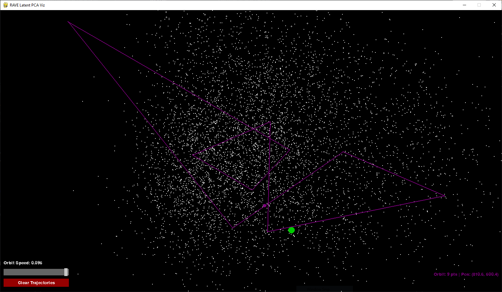

# NEBULA: RAVE Latent PCA Visualizer




Results Video Documentation: https://tamcloud.kunstuni-linz.at/s/QnWNEQkAobGseGA

A suite of tools for analyzing and visualizing audio encoded into the latent space of a pre-trained RAVE model. This project extracts latent vectors from audio files, applies PCA to reduce their dimensionality (2D or 3D), and then visualizes these PCA mappings in an interactive GUI. The GUI supports camera rotation, zoom, and smooth SLERP (spherical linear interpolation) between latent vectors. OSC messages are sent in real time to external applications (such as a Pure Data patch) for further processing or sound synthesis.

## Overview

This project provides a full workflow for working with the latent space of a RAVE model:

1. **Latent Extraction & PCA Mapping:**  
   Audio files are encoded using a pre-trained RAVE TorchScript model. The latent vectors are concatenated and processed with PCA to yield a 2D or 3D mapping. The result is saved as a JSON file.

2. **Interactive Visualization:**  
   A GUI loads the PCA JSON file, auto-detecting whether the data is 2D or 3D. For 3D data, the GUI provides interactive camera rotation (via right-click drag) and zoom (via mouse scroll). Additionally, when the user hovers over a bubble representing a PCA sample, the GUI smoothly interpolates (using SLERP) between latent vectors and sends the current latent vector via OSC.

3. **OSC Integration & Pure Data:**  
   OSC messages are sent to an external OSC server (e.g., a Pure Data patch) which can be used to drive sound synthesis or other processing tasks using RAVE via the nn~ external.

## Features

- **Latent Space Analysis:**  
  Encode audio files using a pre-trained RAVE model and extract latent vectors.

- **PCA Mapping Export:**  
  Compute and export PCA mappings (2D or 3D) from the latent space as a JSON file.

- **Interactive Visualization:**  
  Visualize the PCA mapping in a Pygame window.  
  - **2D Mode:** Directly displays bubbles using 2D coordinates.  
  - **3D Mode:** Uses perspective projection with interactive rotation and zoom.

- **SLERP Interpolation:**  
  Smooth interpolation between latent vectors when hovering over bubbles.

- **OSC Messaging:**  
  Sends OSC messages containing the interpolated latent vector for external control.

- **Pure Data Patch:**  
  Includes a sample Pd patch to receive and process OSC messages.

## Installation

1. **Clone the Repository:**

   ```bash
   git clone https://github.com/yourusername/rave-latent-pca-visualizer.git
   cd rave-latent-pca-visualizer
   ```

2. Install Dependencies:
    ```bash
    pip install -r requirements.txt
    ```

3. Prepare Your RAVE Model and Audio Dataset:
   
   Place your pre-trained RAVE TorchScript model in an appropriate location (update the ```--model_path``` accordingly).
   
   Ensure you have a directory with your .wav audio files.

## Usage

**Exporting PCA Mapping JSON:**

  Run the ```rave-latent-to-pca-map.py``` script to generate a JSON file containing the PCA mapping.

For 2D output:
```bash
python rave-latent-to-pca-map.py --model_path path/to/your/model.ts --audio_dir path/to/your/audio_dataset --n_components 2
```
For 3D output:
```bash
python rave-latent-to-pca-map.py --model_path path/to/your/model.ts --audio_dir path/to/your/audio_dataset --n_components 3
```
```
    --model_path: Path to the RAVE model.
    --audio_dir: Directory containing .wav files.
    --n_components: Set to 2 for 2D or 3 for 3D.
    --output_json: (Optional) Specify a custom output file name.
```

**Running the Visualization GUI:**

Launch the GUI by specifying the path to the PCA JSON file:

```bash
python gui.py --pca_json path/to/your_pca_mapping.json
```

Interactive Controls:
```
    Camera Rotation (3D only):
    Right-click and drag the mouse.
    Zoom (3D only):
    Use the mouse scroll wheel (scroll up to zoom in, scroll down to zoom out).
    SLERP Interpolation:
    Hover over a bubble to smoothly interpolate the latent vector and send it via OSC.
    Double-click on the latent to set a point in the orbit interpolation.

```

### Author Credits
```
  Moisés Horta Valenzuela
  Guest Professor, Winter Semester 2024-2025
  Enrique Tomás

```
